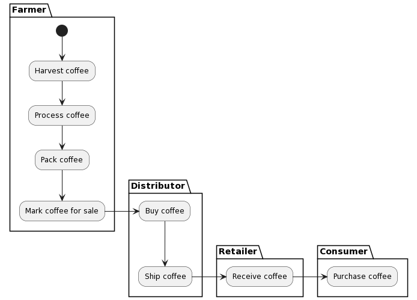
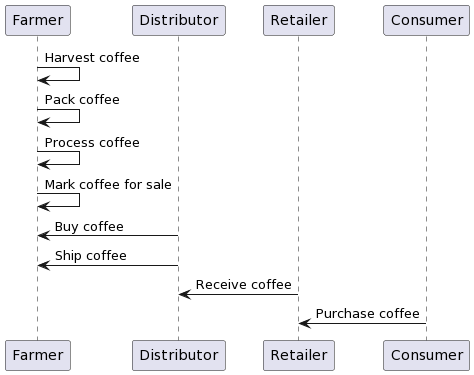
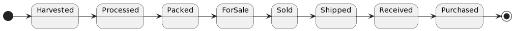
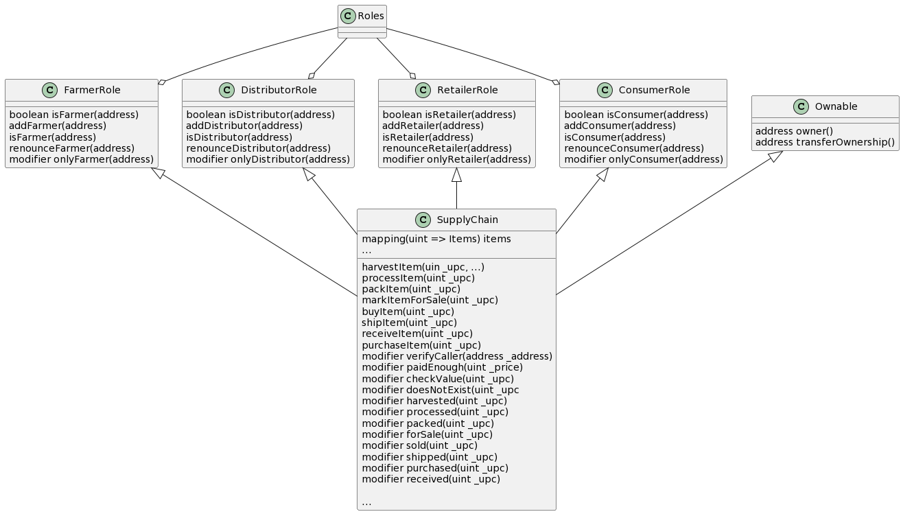

## Domain Model

### Assets & Actors

- Selected supply chain: Coffee production and distribution

- Assets:
  - Coffee

- Actors:
  - farmer
  - distributor
  - retailer
  - consumer

- Roles:

| Actor |              Role              |
|:---:|:------------------------------:|
|Farmer|       can harvest coffee       |
|Farmer|       can process coffee       |
|Farmer|        can pack coffee         |
|Farmer| can mark coffee for sale |
|Distributor|      can buy coffee      |
|Distributor|     can ship coffee      |
|Retailer|    can receive coffee    |
|Consumer|   can purchase coffee    |

### Activity Diagram

### Sequence Diagram

### State Diagram

### Class Diagram

### Libraries ️

| Libraries used | Version | Motivation |
|:---:|:---:|:---:|
|web3.min.js|0.19.0|To allow interaction with ethereum contracts from browser|
|truffle-contract.js|0.5.5|To allow interaction with ethereum contracts from browser|
|jquery-3.6.0.min.js|3.6.0|To build very simple front-end (the focus of the project are the contracts)|

### IPFS

| Libraries used | Version | Motivation |
|:---:|:---:|:---:|
|IPFS not used|N/A|N/A|
